# Homelab Architecture Diagrams

Visual reference for understanding how all components in your K3s homelab cluster connect and interact.

> **Note:** These diagrams use [Mermaid](https://mermaid.js.org/) and will render automatically on GitHub and most modern markdown viewers.

## Table of Contents
- [Physical Architecture](#physical-architecture)
- [Network Topology](#network-topology)
- [Storage Architecture](#storage-architecture)
- [GitOps Flow](#gitops-flow)
- [Certificate Management Flow](#certificate-management-flow)
- [Request Flow (HTTPS)](#request-flow-https)
- [Monitoring Stack](#monitoring-stack)
- [Backup Architecture](#backup-architecture)
- [Component Dependencies](#component-dependencies)

---

## Physical Architecture

### Hardware and Node Layout

```mermaid
graph TB
    subgraph Internet["🌐 Internet / External Network (192.168.0.0/24)"]
        ISP[Internet Service Provider]
    end

    subgraph Gateway["🔥 OpenWrt Gateway (192.168.0.21)"]
        GW[OpenWrt Router<br/>- NAT & Port Forwarding<br/>- SSH Jump Host<br/>80/443 → 10.0.0.65]
    end

    subgraph Internal["🏠 Internal Network (10.0.0.0/24)"]
        subgraph Node1["📦 node1 (10.0.0.11) - External Services"]
            N1S[Services:<br/>- Bind9 DNS :53<br/>- Vault :8200<br/>- Minio S3 :9091<br/>- HAProxy<br/>- iSCSI Target]
            N1D[Storage:<br/>NVMe SSD 200GB<br/>├─ LUN1 100GB → node2<br/>└─ LUN2 100GB → node3]
        end

        subgraph Node2["⚙️ node2 (10.0.0.12) - K3s Master"]
            N2R[Raspberry Pi 5 8GB<br/>Roles:<br/>- K3s Control Plane<br/>- etcd<br/>- K8s API :6443]
            N2S[Storage:<br/>iSCSI from node1 LUN1<br/>Mounted: /storage 100GB]
            N2M[Resources:<br/>CPU: 4 cores ARM64<br/>RAM: 8GB 58% used]
        end

        subgraph Node3["⚙️ node3 (10.0.0.13) - K3s Worker"]
            N3R[Raspberry Pi 5 8GB<br/>Roles:<br/>- K3s Worker<br/>- Application Workloads]
            N3S[Storage:<br/>iSCSI from node1 LUN2<br/>Mounted: /storage 100GB]
            N3M[Resources:<br/>CPU: 4 cores ARM64<br/>RAM: 8GB 26% used]
        end

        subgraph LB["Load Balancer IPs (Cilium)"]
            LB1[10.0.0.65<br/>NGINX Ingress]
            LB2[10.0.0.66<br/>Fluentd]
            LB3[10.0.0.67<br/>Istio Gateway]
        end
    end

    ISP --> GW
    GW --> Node1
    GW --> Node2
    GW --> Node3

    N1D -.iSCSI.-> N2S
    N1D -.iSCSI.-> N3S

    Node2 --> LB
    Node3 --> LB

    style Node1 fill:#e1f5fe
    style Node2 fill:#fff3e0
    style Node3 fill:#fff3e0
    style Gateway fill:#ffebee
    style LB fill:#f3e5f5
```



**Cluster Summary:**
- **Total CPU:** 8 cores (ARM64)
- **Total RAM:** 16GB (6.7GB used, 9.3GB available)
- **Total Storage:** 200GB (centralized on node1)

---

## Network Topology

### Complete Network Flow


### DNS Resolution Flow


---

## Storage Architecture

### Complete Storage Stack

```mermaid
graph TB
    subgraph Apps["Application Layer"]
        Pod1[Pod A<br/>volumeMount: /data]
        Pod2[Pod B<br/>volumeMount: /data]
        Pod3[Pod C<br/>volumeMount: /data]
    end

    subgraph K8s["Kubernetes Layer"]
        PVC1[PVC: my-data-1<br/>10Gi ReadWriteOnce]
        PVC2[PVC: my-data-2<br/>5Gi ReadWriteOnce]
        PVC3[PVC: my-data-3<br/>20Gi ReadWriteMany]

        SC[StorageClass: longhorn<br/>Provisioner: driver.longhorn.io<br/>ReclaimPolicy: Delete<br/>VolumeExpansion: true]

        PV1[PersistentVolume<br/>Managed by Longhorn<br/>Replicas: 2-3]
        PV2[PersistentVolume<br/>Managed by Longhorn<br/>Replicas: 2-3]
        PV3[PersistentVolume<br/>Managed by Longhorn<br/>Replicas: 2-3]
    end

    subgraph Longhorn["Longhorn Storage Layer"]
        LM[Longhorn Manager<br/>Volume orchestration<br/>Replication<br/>Snapshots<br/>Backup to S3]

        Node2Data[node2:/storage/longhorn/<br/>volume-1-replica-1<br/>volume-2-replica-1]
        Node3Data[node3:/storage/longhorn/<br/>volume-1-replica-2<br/>volume-3-replica-1]
    end

    subgraph iSCSI["iSCSI Layer"]
        Node2Mount[node2 (10.0.0.12)<br/>iSCSI Initiator<br/>/dev/sdb → /storage 100GB]
        Node3Mount[node3 (10.0.0.13)<br/>iSCSI Initiator<br/>/dev/sdb → /storage 100GB]

        iSCSITarget[node1 iSCSI Target<br/>iqn.2025-01.com.jacobgade<br/>├─ LUN1 100GB → node2<br/>└─ LUN2 100GB → node3]
    end

    subgraph Physical["Physical Storage"]
        SSD[node1 NVMe SSD<br/>200GB Total<br/>├─ Root: 30GB<br/>└─ LVM: 170GB<br/>   ├─ LUN1: 100GB<br/>   └─ LUN2: 100GB]
    end

    Pod1 --> PVC1
    Pod2 --> PVC2
    Pod3 --> PVC3

    PVC1 --> SC
    PVC2 --> SC
    PVC3 --> SC

    SC --> PV1
    SC --> PV2
    SC --> PV3

    PV1 --> LM
    PV2 --> LM
    PV3 --> LM

    LM --> Node2Data
    LM --> Node3Data

    Node2Data --> Node2Mount
    Node3Data --> Node3Mount

    Node2Mount --> iSCSITarget
    Node3Mount --> iSCSITarget

    iSCSITarget --> SSD

    style Apps fill:#e1f5fe
    style K8s fill:#fff3e0
    style Longhorn fill:#f3e5f5
    style iSCSI fill:#e8f5e9
    style Physical fill:#ffebee
```

### Storage Data Flow


---

## GitOps Flow

### FluxCD Deployment Pipeline

```mermaid
graph TB
    subgraph Dev["👨‍💻 Developer Workflow"]
        Edit[Edit files in<br/>kubernetes/platform/myapp/]
        Commit[git commit -m<br/>'feat: update myapp']
        Push[git push origin master]
    end

    subgraph Git["📦 GitHub Repository"]
        Repo[github.com/JacobCGade/homelab<br/>Branch: master]
    end

    subgraph Flux["🔄 FluxCD (flux-system namespace)"]
        Source[Source Controller<br/>Polls every 1 minute]
        Kustomize[Kustomize Controller<br/>Processes manifests]
        Git2[GitRepository: flux-system<br/>Watches master branch]
    end

    subgraph Discover["🔍 Discovery"]
        ProdInfra[clusters/prod/infra/<br/>kustomization.yaml]
        AppKust[myapp-app.yaml<br/>FluxCD Kustomization]
        Manifests[platform/myapp/app/<br/>overlays/prod/]
    end

    subgraph Process["⚙️ Processing"]
        Vars[Inject variables from<br/>cluster-settings ConfigMap<br/>CLUSTER_DOMAIN, etc.]
        KustBuild[Build with Kustomize<br/>base + prod overlays]
        Final[Final manifests ready]
    end

    subgraph K8s["☸️ Kubernetes"]
        API[Apply to K8s API]
        Scheduler[Schedule pods]
        Running[Pod running!]
    end

    Edit --> Commit
    Commit --> Push
    Push --> Repo

    Repo --> Source
    Source --> Git2
    Git2 --> Kustomize

    Kustomize --> ProdInfra
    ProdInfra --> AppKust
    AppKust --> Manifests

    Manifests --> Vars
    Vars --> KustBuild
    KustBuild --> Final

    Final --> API
    API --> Scheduler
    Scheduler --> Running

    style Dev fill:#e3f2fd
    style Git fill:#fff3e0
    style Flux fill:#f3e5f5
    style Discover fill:#e8f5e9
    style Process fill:#fff9c4
    style K8s fill:#ffebee
```



### Directory Structure and Discovery


---

## Certificate Management Flow

### Complete TLS Certificate Lifecycle


### Certificate Flow Diagram


---

## Request Flow (HTTPS)

### External Request to Internal Service

```mermaid
sequenceDiagram
    participant User as 🌐 User's Browser
    participant DNS as Cloudflare DNS
    participant GW as OpenWrt Gateway<br/>(192.168.0.21)
    participant Cilium as Cilium LB<br/>(10.0.0.65)
    participant NGINX as NGINX Ingress<br/>Controller
    participant CoreDNS as CoreDNS
    participant Service as K8s Service<br/>longhorn-frontend
    participant Pod as Longhorn UI Pod

    User->>DNS: Query longhorn.homelab.jacobgade.com
    DNS-->>User: Returns 192.168.0.21

    User->>GW: HTTPS Request :443
    Note over User,GW: TLS encrypted

    GW->>Cilium: NAT forward to 10.0.0.65:443
    Note over GW,Cilium: Port forwarding rule

    Cilium->>NGINX: Route to NGINX pod
    Note over Cilium,NGINX: Cilium CNI routing

    NGINX->>NGINX: 1. Terminate TLS<br/>using longhorn-tls Secret
    NGINX->>NGINX: 2. Check Host header<br/>longhorn.homelab.jacobgade.com
    NGINX->>NGINX: 3. Match Ingress rule

    NGINX->>CoreDNS: Resolve longhorn-frontend<br/>.longhorn-system.svc
    CoreDNS-->>NGINX: Returns ClusterIP 10.43.x.x

    NGINX->>Service: HTTP to backend service
    Service->>Pod: Forward to pod

    Pod->>Pod: Process request<br/>Generate HTML

    Pod-->>Service: Response
    Service-->>NGINX: Response
    NGINX->>NGINX: Encrypt with TLS
    NGINX-->>Cilium: Encrypted response
    Cilium-->>GW: Response
    GW-->>User: Response

    Note over User,Pod: Total latency: 30-50ms
```



### Internal Pod-to-Pod Communication


---

## Monitoring Stack

### Observability Architecture

```mermaid
graph TB
    subgraph Sources["📊 Data Sources"]
        Apps[Application Pods<br/>/metrics endpoints]
        Kubelets[Kubelet<br/>Node metrics]
        KSM[kube-state-metrics<br/>K8s object metrics]
        NodeExp[node-exporter<br/>System metrics]
        ExtNode[node1<br/>External metrics]
    end

    subgraph Collection["📈 Metrics Collection"]
        SM[ServiceMonitors<br/>Define scrape targets]
        PM[PodMonitors<br/>Define pod targets]
        Prom[Prometheus<br/>Scrape every 30s<br/>Store in TSDB<br/>Retention: 15 days]
    end

    subgraph Visualization["📊 Visualization"]
        Grafana[Grafana<br/>Dashboards<br/>Currently disabled]
        PromUI[Prometheus UI<br/>PromQL queries]
    end

    subgraph Alerting["🚨 Alerting"]
        Rules[PrometheusRules<br/>Alert definitions]
        AM[Alertmanager<br/>Route & notify]
        Notify[Notifications:<br/>- Slack<br/>- Email<br/>- PagerDuty<br/>- Webhook]
    end

    Apps --> SM
    Kubelets --> SM
    KSM --> SM
    NodeExp --> PM
    ExtNode --> Prom

    SM --> Prom
    PM --> Prom

    Prom --> Grafana
    Prom --> PromUI

    Prom --> Rules
    Rules --> AM
    AM --> Notify

    style Sources fill:#e3f2fd
    style Collection fill:#fff3e0
    style Visualization fill:#e8f5e9
    style Alerting fill:#ffebee
```



### Metric Collection Flow


---

## Backup Architecture

### Multi-Layer Backup Strategy


### Disaster Recovery Workflow

```mermaid
graph TB
    Start[💥 Disaster: Complete cluster loss]

    Start --> Step1[1. Reinstall OS on nodes<br/>Using cloud-init configs]
    Step1 --> Step2[2. Run Ansible playbooks<br/>make external-setup<br/>make nodes-setup<br/>make k3s-install<br/>make k3s-bootstrap]
    Step2 --> Step3[3. GitOps auto-deploys<br/>FluxCD pulls from Git<br/>All apps deployed automatically]
    Step3 --> Step4[4. Enable Velero<br/>Uncomment in infra/kustomization.yaml]
    Step4 --> Step5[5. Restore from backup<br/>velero restore create<br/>--from-backup full-backup]
    Step5 --> Step6[6. Longhorn restores volumes<br/>Pods attach to restored PVCs]
    Step6 --> Done[✅ Cluster fully operational<br/>with all data intact!]

    Note1[Recovery time:<br/>30-60 minutes]

    Done -.-> Note1

    style Start fill:#ffebee
    style Done fill:#e8f5e9
    style Note1 fill:#fff3e0
```



---

## Component Dependencies

### Startup Order and Critical Paths


### Critical Failure Paths


---

## Quick Reference

### Key Information

**IP Addresses:**
- Gateway/Jump Host: `192.168.0.21`
- node1 (External): `10.0.0.11` (Vault, Minio, DNS, iSCSI)
- node2 (K3s Master): `10.0.0.12`
- node3 (K3s Worker): `10.0.0.13`
- NGINX LoadBalancer: `10.0.0.65`
- Istio Gateway: `10.0.0.67`

**Access Methods:**
```bash
# SSH tunnel for K8s API
ssh -f -N -L 6443:10.0.0.12:6443 root@192.168.0.21

# SSH to nodes (via jump host)
ssh -J root@192.168.0.21 root@10.0.0.11  # node1
ssh -J root@192.168.0.21 root@10.0.0.12  # node2
ssh -J root@192.168.0.21 root@10.0.0.13  # node3

# Access Vault
ssh -L 8200:10.0.0.11:8200 root@192.168.0.21
# https://localhost:8200

# Access Minio
ssh -L 9091:10.0.0.11:9091 root@192.168.0.21
# http://localhost:9091
```

**Public Services:**
- Prometheus: `https://monitoring.homelab.jacobgade.com/prometheus`
- Alertmanager: `https://monitoring.homelab.jacobgade.com/alertmanager`
- Longhorn: `https://longhorn.homelab.jacobgade.com`
- Hubble: `https://hubble.homelab.jacobgade.com`

**Resources:**
- Total CPU: 8 cores (ARM64)
- Total RAM: 16GB (6.7GB used, 9.3GB available)
- Total Storage: 200GB (centralized SAN on node1)

---

## Additional Resources

- **CHEATSHEET.md**: Commands and operations reference
- **CLAUDE.md**: Project overview and current status
- **README.md**: Original picluster documentation

For detailed command references and troubleshooting workflows, see [CHEATSHEET.md](./CHEATSHEET.md).
